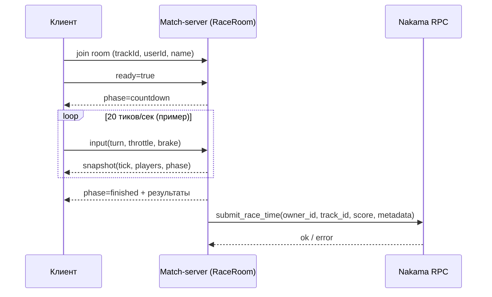

# ПОЛЗУНКИ: Архитектура Онлайн-Режима

## 1. Цель онлайн-архитектуры

- Сделать гонку сетевой и соревновательной, сохранив честность результатов.
- Перенести расчет гонки на сервер (authoritative simulation), чтобы клиент не мог подменять физику/время.
- Обеспечить устойчивую запись результатов в лидерборд через Nakama.

## 2. Контуры системы

```mermaid
flowchart LR
  A[Браузерный клиент\nWeb + UI + отправка input] -->|WebSocket: room input/ready/ping| B[Match-server\nColyseus RaceRoom]
  B -->|snapshot/phase/results| A
  B -->|HTTP RPC submit_race_time| C[Nakama Runtime\nRPC + Leaderboards]
  C --> D[(Postgres)]
  A -->|HTTP GET leaderboard\n(опционально)| C
```

## 3. Роли компонентов

### 3.1 Браузерный клиент
- Показывает экраны (`main/snake/track/race/results`).
- Для онлайн-режима отправляет только управление игрока (`turn/throttle/brake`, `ready`, `ping`).
- Принимает authoritative `snapshot` и рендерит состояние гонки.
- Не принимает финальное решение о финише/времени/победе.

### 3.2 Match-server (Colyseus)
- Источник истины по состоянию гонки в комнате (`phase`, позиции, прогресс, финиш).
- Обрабатывает input игроков на фиксированном тике сервера.
- Ведет жизненный цикл комнаты: `lobby -> countdown -> running -> finished`.
- Публикует `snapshot` всем клиентам.
- После финиша отправляет результаты в Nakama RPC.

### 3.3 Nakama Runtime
- Хранит и обслуживает лидерборды по трассам.
- Принимает RPC `submit_race_time`.
- Валидирует payload и пишет рекорд в соответствующий leaderboard.

### 3.4 Postgres
- Постоянное хранилище данных Nakama (лидерборды, рекорды, метаданные).

## 4. Сетевой протокол комнаты (минимум)

### Сообщения клиент -> сервер
- `ready`: готовность игрока к старту.
- `input`: управление (`turn`, `throttle`, `brake`).
- `ping`: проверка задержки.

### Сообщения сервер -> клиент
- `snapshot`: текущее состояние комнаты и игроков.
- `pong`: ответ на ping.

## 5. Жизненный цикл онлайн-заезда



## 6. Поток данных результата

1. Match-server фиксирует `finishTimeMs` для игроков.
2. Сортирует результаты по времени и/или прогрессу.
3. Для каждого валидного результата вызывает RPC `submit_race_time`.
4. При временной ошибке делает повторную отправку.
5. После успешной записи помечает результат как отправленный.

## 7. Декомпозиция онлайн-кода (предлагаемая)

- `src/game/online/roomClient.js`: подключение к комнате, переподключение, обработка сообщений.
- `src/game/online/inputBridge.js`: перевод локальных клавиш в сетевые `input` сообщения.
- `src/game/online/snapshotStore.js`: хранение последнего authoritative состояния.
- `src/game/online/onlineRaceFlow.js`: оркестрация онлайн-фаз UI.
- `src/game/online/leaderboardApi.js`: чтение таблиц лидеров из Nakama/бэкенда.

Сервер:
- `match-server/src/raceRoom.js`: authoritative логика комнаты.
- `match-server/src/nakamaClient.js`: отправка RPC в Nakama.

## 8. Нефункциональные требования

- Тик сервера: 20 Hz (или выше после профилирования).
- Сервер authoritative по физике и финишу.
- Деградация при сетевых проблемах: клиент не падает, показывает статус соединения.
- Идемпотентная/повторяемая отправка результатов при временных сбоях RPC.

## 9. Этапы внедрения

### Этап A (MVP онлайн)
- Подключение клиента к `race` комнате.
- Отправка `ready/input`.
- Рендер authoritative snapshot.
- Финиш + отправка результата через текущий серверный pipeline.

### Этап B (стабилизация)
- Reconnect/Resume для отвалов.
- Расширенная серверная валидация input.
- Метрики: RTT, tick drift, dropped snapshots.

### Этап C (production)
- Полноценный экран лидерборда.
- Матчмейкинг и приватные комнаты.
- Анти-чит мониторинг и аудит результатов.

